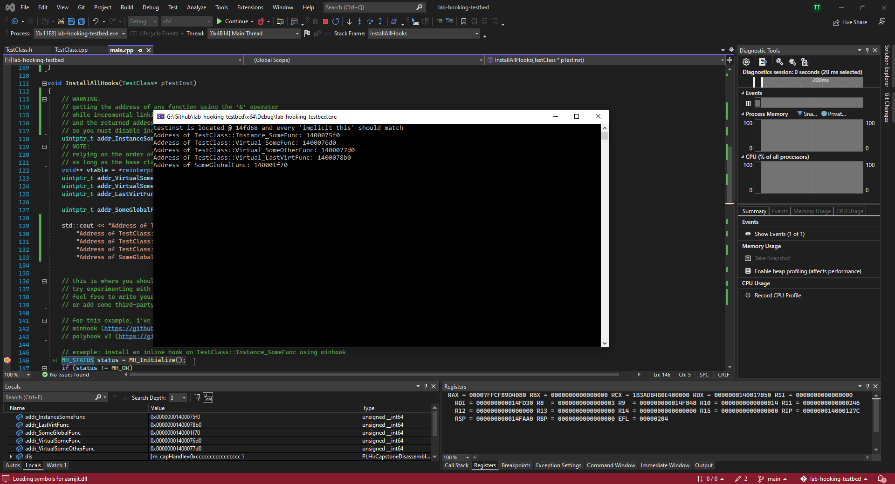
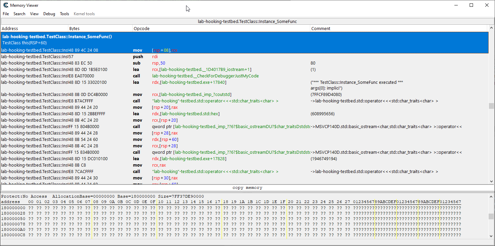
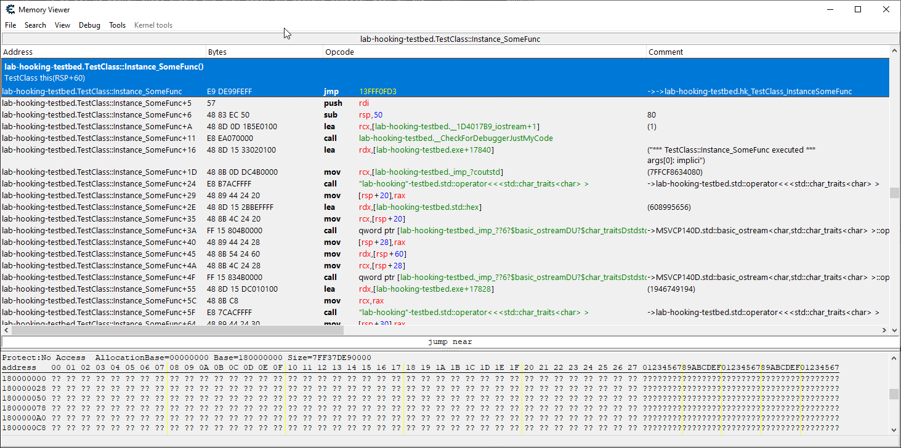
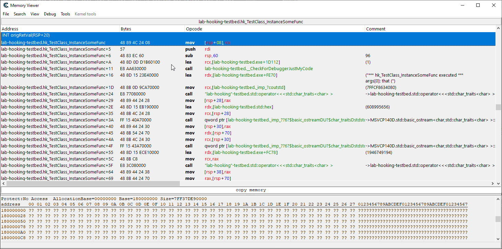
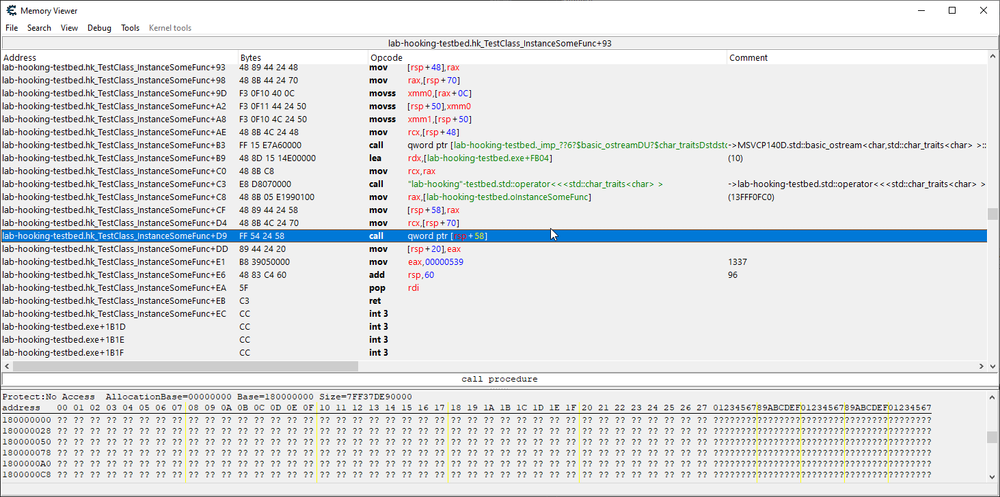
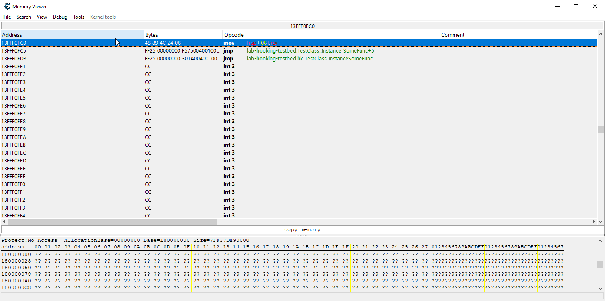
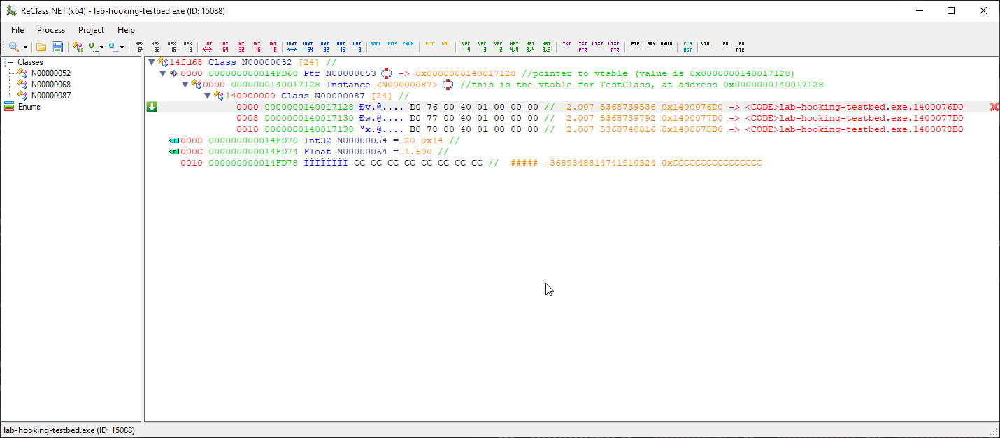
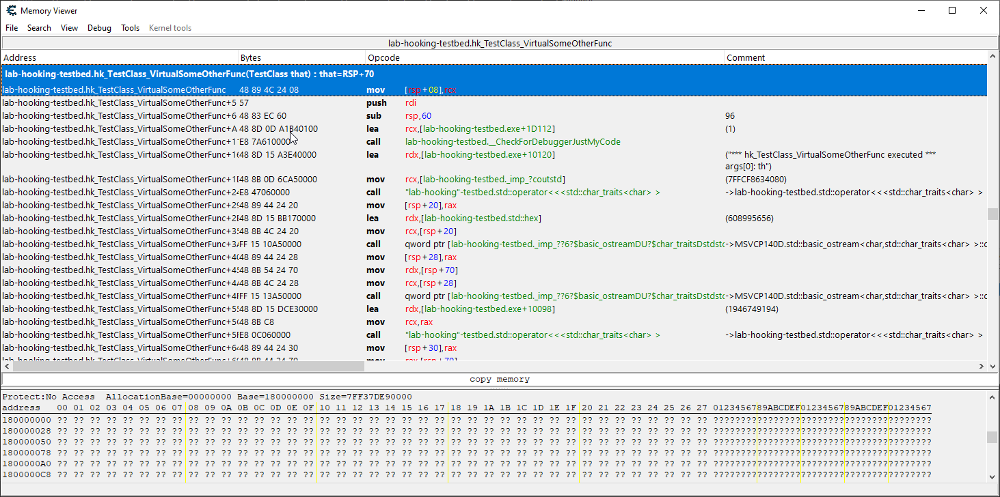

# lab-hooking-testbed #

'Hooking' is altering the control flow of a program to execute your logic.<br>
A 'hook' is the presence and mechanism of such an alteration.<br>
This is a walkthrough of how hooking works and a little testbed for users to test their own hooking techniques.<br>
Uses the [minhook](https://github.com/TsudaKageyu/minhook) and [PolyHook v2](https://github.com/stevemk14ebr/PolyHook_2_0) hooking libraries for some examples.<br>

## Prerequisites ##

This lab is intended for fledgling reverse engineers / binary hackers. Since these are specialized topics within the broader CompSci field, it is assumed that you're already comfortable with programming and understand the basics of x86-64 assembly language.

1. Visual Studio to be able to compile this lab.
2. vcpkg w/ visual studio integration (instructions are provided below).
3. Git, and properly included in your PATH environment variable.
4. A memory viewer and disassembler ([cheat engine](https://www.cheatengine.org/) will be used in the walkthrough).
5. Understanding of C++ classes and how virtual methods are implemented (the virtual method table).
6. Basic knowledge of program control flow.
7. Basic knowledge of assembly and how high-level code gets compiled down to machine-level code.
8. Basic understanding of how functions are often compiled and what they look like in a disassembler (callers/callees, how arguments are passed (x86 and x64 differs!), function prologues and epilogues).

## Objectives ##

1. To learn how to alter the control flow of a program to execute your own logic.
2. To learn about and experiment with different hooking techniques.

## Setup Instructions ##

1. Install vcpkg ([official instructions](https://github.com/microsoft/vcpkg#quick-start-windows)).
2. Integrate vcpkg with visual studio (`.\vcpkg\vcpkg integrate install` in elevated command prompt)
3. Install polyhook and minhook via vcpkg
    * `.\vcpkg\vcpkg install polyhook2`
    * `.\vcpkg\vcpkg install minhook`
    * append `:x64-windows` to the above commands to install the x64 versions as well. eg: `.\vcpkg\vcpkg install minhook:x64-windows`

If you installed vcpkg to your root drive (eg: `C:\dev`) and integrated with visual studio correctly then you'll be able to simply `#include <whateverHeader>` that those libraries provide.

## Walkthrough ##

You should begin by opening the project in visual studio and ensuring it compiles and runs fine for you.

## Inline Hook ##

|  |
|:--:|
| <sub>Image: Placing breakpoint just after function addresses are output and running the program.</sub> | 

The first step would be to place a breakpoint in the `InstallAllHooks` function after the function addresses are output but before the actual hooking logic is ran.<br>
As you can see in the above image, the address of `TestClass::Instance_SomeFunc` for me is `1400075e0` so I'll plug that into cheat engine's disassembler to see what the function looks like **before** we install our hook.<br>
To do so, we launch cheat engine and then click the glowing computer icon in the top left and select our `lab-hooking-testbed.exe` in the 'Processes' tab.<br>
Now that cheat engine is attached to our process we can click the 'Memory View' button located along the left side of the main window. This will open another window. In that window, right-click anywhere in the disassembler pane and select 'Go to address' or simply press Ctrl+G and then input the function address.

|  |
|:--:|
| <sub>Image: Viewing the original (unmodified) TestClass::Instance_SomeFunc function with cheat engine's disassembler.</sub> | 

I compiled with PDB symbols which cheat engine automatically read and loaded into its disassembler which is why it's able to display the name of the function and other helpful information. In real-world scenarios you may see less information.<br>
The important part is that we can see the function's machine code in assembly language:
```asm
mov [rsp+08], rcx
push rdi
sub rsp,50
```
This is a pretty standard function prologue. Now let's go back to visual studio and step through the code line-by-line until we perform the inline hook of this function. For brevity, I'll just place a breakpoint at the first std::cout call after the hook is installed.<br>
Now if you go back to cheat engine you'll see the assembly instructions changed:
```asm
jmp 13FFF0FD3
push rdi
sub rsp,50
```
|  |
|:--:|
| <sub>Image: Viewing the hooked TestClass::Instance_SomeFunc function with cheat engine's disassembler.</sub> | 

As you can see, an inline hook is one that simply writes a `jmp` instruction somewhere over the original function's bytes. Now, if you were to try to execute the original function from within your hook handler function you'll eventually crash from a stack overflow due to infinite recursion.<br>
So that's where the 'trampoline' comes into play. Let's right-click that `jmp` instruction and select 'Follow'. With minhook, this will lead to an additional `jmp` that you should also follow.<br>
You should now be viewing your hook handler function.
|  |
|:--:|
| <sub>Image: Our hook handler for TestClass::Instance_SomeFunc, hk_TestClass_InstanceSomeFunc, with cheat engine's disassembler.</sub> | 

Now scroll down to near the end where we invoke the trampoline.
It may be helpful to note that the source code for this function is this:
```cpp
int hk_TestClass_InstanceSomeFunc(TestClass* that)
{
    std::cout << "*** hk_TestClass_InstanceSomeFunc executed ***\n"
        "\targs[0]: that (implicit this) = " << std::hex << reinterpret_cast<uintptr_t>(that) << "\n"
        "\t\tthis->SomeIntField: " << that->SomeIntField << "\n"
        "\t\tthis->SomeFloatField: " << that->SomeFloatField << "\n";

    int origRetVal = oInstanceSomeFunc(that);
    return 1337;
}
```

We're looking for the assembly instructions that correspond to `oInstanceSomeFunc(that);`

|  |
|:--:|
| <sub>Image: The call to our hook's trampoline inside the hk_TestClass_InstanceSomeFunc function.</sub> | 

The full call is comprised of these assembly instructions:
```asm
mov rax,[14001B4E0] ; seen as mov rax,[lab-hooking-testbed.oInstanceSomeFunc] if symbols are loaded
mov [rsp+58], rax
mov rcx,[rsp+70]
call qword ptr [rsp+58] ; effectively calls rax, which is the value at 14001B4E0
mov [rsp+20], eax
```
So we can see that the address of our trampoline is stored in a variable at address `14001B4E0`.<br>
So pull up cheat engine's main window and click on 'Add Address Manually' which is to the far right of the 'Memory View' button. Put in the address and change the type to either 4 bytes or 8 bytes depending on whether you're running the x86 or x64 build of the lab (since we know this value is an address).<br>
For me, the value is `000000013FFF0FC0` but this **will** be different every time since the trampoline is dynamically allocated.<br>
Let's go back once more to cheat engine's memory viewer window and right-click and select 'Go to address' and put in whatever your value is.

|  |
|:--:|
| <sub>Image: The trampoline for our hook.</sub> | 

We can see the trampoline's assembly code is as follows:
```asm
mov [rsp+08],rcx
jmp 1400075F5 ; seen as jmp lab-hooking-testbed.TestClass::Instance_SomeFunc+5 if symbols are loaded
jmp 140001A30 ; seen as jmp lab-hooking-testbed.hk_TestClass_InstanceSomeFunc if symbols are loaded
```

Doesn't that first instruction look familiar? It's the first instruction of the original (unmodified) `TestClass::Instance_SomeFunc` function, the one that we replaced with our `jmp` instruction.<br>
Our trampoline executes that and then `jmp`'s to the **next instruction** in `TestClass::Instance_SomeFunc` which skips our hook.<br>
This allows us to execute the original function from within our hook without suffering from stack overflow :) <br>
The next hook in the lab project is another inline hook, but using the polyhook library. You're welcome to step through it and follow these same instructions, but note that while the implementation may be different the overall process remains the same: a `jmp` instruction is written somewhere in the original function that leads to our hook handler function, and the trampoline will execute those overwritten instructions before `jmp`'ing just past the `jmp` instruction we wrote.

## Virtual Method Table Hook ##

Begin by placing a breakpoint on the line that begins like `std::cout << "Performing vtable entry swap of TestClass::VirtualSomeOtherFunc` within the `InstallAllHooks` function. We want this breakpoint to be hit **before** the hook is performed so we can look at the before and then the after.<br>
Now, this is a virtual method table hook, so if you'll refer to your C++ knowledge you'll know that virtual functions are implemented by prepending a pointer field to the class' members. This pointer points to that class' virtual method table, where each entry in the table is a pointer to the implementation of each inherited virtual method.<br>
So let's start by looking at our class instance in memory. Referring back to the very first line output by the lab program, I can see that `testInst` is located @ `14fd68`. I'll be using [ReClass.NET](https://github.com/ReClassNET/ReClass.NET) as my memory viewer as I find it's best suited to the task of analyzing object instances, but you could continue to use cheat engine if you know what you're doing.

|  |
|:--:|
| <sub>Image: Our `testInst` seen in ReClass.NET, with the pointer to its original (unmodified) virtual method table expanded and field datatypes defined.</sub> | 

You can see in the image above that I defined the fields of our `testInst` instance. We know that the first field is a pointer because `TestClass` inherits virtual functions from its base class, and we know that the next two fields are an int and float whose initial values should be set to 20 and 1.5f.<br>
ReClass.NET allows expansion of pointer fields, so I clicked the dropdown arrow to see the region of memory that's being pointed to (this region starts at address `0x0000000140017128` for me) and since I know there's only 3 virtual functions I selected all but the first 3 rows and deleted them to beautify the view.<br>
You can see that the first 3 entries in the virtual method table point to `1400076D0`, `1400077D0`, and `1400078B0` respectively. As an added feature, ReClass.NET also tells us these addresses are located in the .text section (denoted by '\<CODE>' in ReClass.NET) so this confirms that we're looking at a virtual method table.<br>

Let's go back to visual studio and step through until after the hook is performed (it's only a few lines).<br>
If we look back at our memory viewer we can see that the virtual method table entries have changed. Now they point to `1400076D0`, `140001C60`, and `1400078B0`. The middle one changed. We know that the second function defined in `TestClass`' base class is `Virtual_SomeOtherFunc` so we know that whenever that function is called on our `testInst` object or any instance of `TestClass` created in the future we'll now be calling the function at `140001C60` instead of `1400077D0`.<br>

|  |
|:--:|
| <sub>Image: Our `testInst` seen again in ReClass.NET, but with a modified virtual method table entry that points to our hook handler function at `140001C60`.</sub> | 

So what function is at `140001C60`? Let's pull that up in cheat engine's memory viewer window by right-clicking anywhere in the disassembly pane and selecting 'Go to address' or simply pressing Ctrl+G keybind. With symbols loaded, cheat engine tells us that it's `lab-hooking-testbed.hk_TestClass_VirtualSomeOtherFunc` which is our hook handler. Without symbols we'd still be able to see the string "*** hk_TestClass_VirtualSomeOtherFunc executed" that's referenced in a `mov` instruction just below the start of the function.

|  |
|:--:|
| <sub>Image: Our `hk_TestClass_VirtualSomeOtherFunc` hook handler function at `140001C60`.</sub> | 

The good thing about hooking virtual methods this way is that we don't modify any code. Because we don't modify any code we don't need a trampoline. We can call the original function from our hook without worry (but in this testbed, it's important not to invoke the function through the class instance itself as that'll lead to it calling the second entry in the virtual method table which... yeah, stack overflow from infinite recursion again :) ). We store the original function in a function pointer (also known as a delegate) in order to invoke it and to restore the original entry if we ever want to unhook.<br>
This type of hook is sometimes referred to as a 'data hook', again, because it doesn't modify any code. In some cases, modifying code may trigger an undesirable reaction but modifying data may not.

## Hardware Breakpoint Hook ##

TO-DO. (I don't know if cheat engine has a way to display debug registers, but it's really late right now so I'll go to bed and do this another day.)